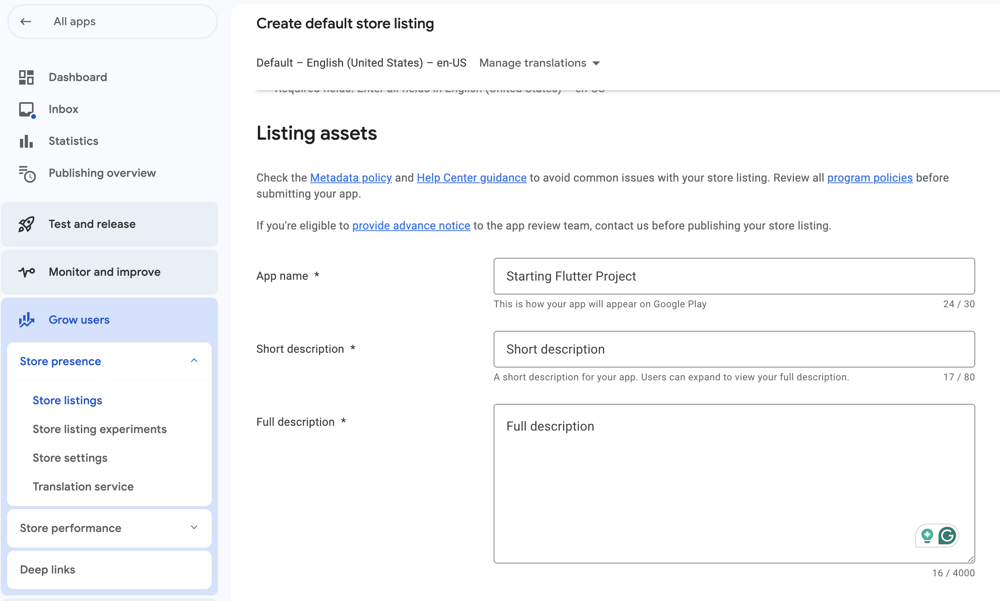
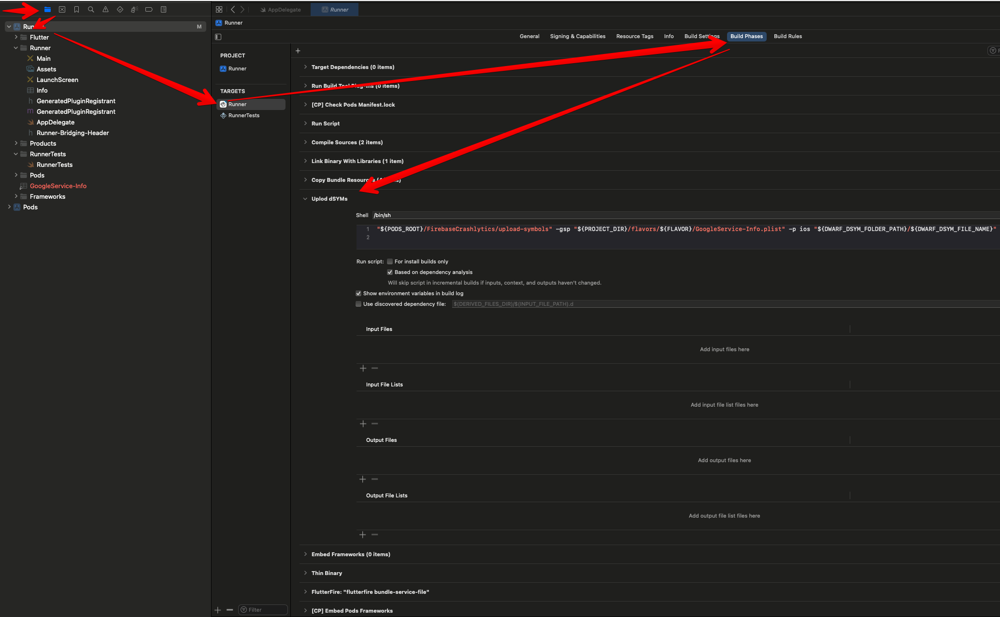
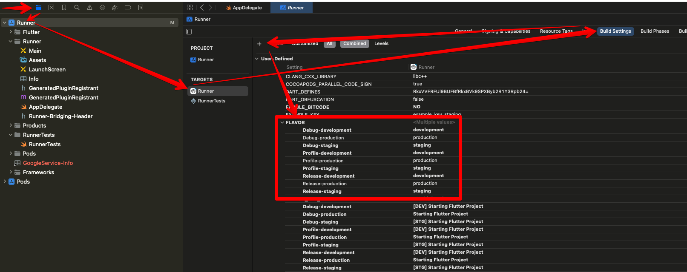

# Starting Flutter Project

![coverage][coverage_badge]
[![style: very good analysis][very_good_analysis_badge]][very_good_analysis_link]
[![License: MIT][license_badge]][license_link]

Template for starting Flutter app based on [Very Good CLI][very_good_cli_link] with some additional stuff.
The goal of that is to use [Very Good CLI][very_good_cli_link] and then apply belowe instructions in order to add some additional stuff. In the future the idea is to create an automatic script/package for that.

---

- [Version manager](#version-manager)
  * [Java version](#java-version)
- [Build the app using Xcode](#build-the-app-using-xcode)
- [Secrets](#secrets)
  * [Preperations](#preperations)
    + [Add new rules to gitignore in the main directory of a project](#add-new-rules-to-gitignore-in-the-main-directory-of-a-project)
  * [Variables](#variables)
  * [Files](#files)
  * [iOS](#ios)
    + [Info.plist](#infoplist)
    + [AppDelegate.swift](#appdelegateswift)
  * [Android](#android)
    + [build.gradle and AndroidManifest](#buildgradle-and-androidmanifest)
    + [MainActivity.kt](#mainactivitykt)
- [Golden - Screenshot Tests](#golden---screenshot-tests)
- [Linter](#linter)
- [Githooks](#githooks)
    + [pre-commit](#pre-commit)
    + [pre-push](#pre-push)
- [Helpful scripts](#helpful-scripts)
- [Github Workflows](#github-workflows)
  * [Update Cache workflow](#update-cache-workflow)
  * [Test and Analyze workflow](#test-and-analyze-workflow)
    + [Missing translations script](#missing-translations-script)
  * [Release to Firebase App Distribution](#release-to-firebase-app-distribution)
  * [Release to Google Play Console](#release-to-google-play-console)
    + [Store Listing management](#store-listing-management)
- [Firebase](#firebase)
  * [App Distribution](#app-distribution)
    + [Using Fastlane](#using-fastlane)
- [Signing the app](#signing-the-app)
  * [Android](#android-1)
- [Getting Started 🚀](#getting-started---)
- [Running Tests 🧪](#running-tests---)
- [Working with Translations 🌐](#working-with-translations---)
  * [Adding Strings](#adding-strings)
  * [Adding Supported Locales](#adding-supported-locales)
  * [Adding Translations](#adding-translations)
  * [Generating Translations](#generating-translations)
- [TODO LIST](#todo-list)

# Version manager
This project uses [mise](https://mise.jdx.dev/) for managing version of Flutter and other required tools. [asdf](https://asdf-vm.com/) should also work fine.

 `.tool-versions` file in root project directory defines Flutter version used for that project. Install [mise](https://mise.jdx.dev/) and type the following command to install that Flutter version.
```bash
mise install
```
## Java version
Your Java version must be compatible with Gradle. Gradle version is defined inside `android/gradle/wrapper/gradle-wrapper.properties` under `distributionUrl` param.

Here you can check compatibility matrix for Gradle and Java https://docs.gradle.org/current/userguide/compatibility.html#java

In order to be sure that Flutter uses correct Java version it's good to set it manually. Firstly run:

```bash
mise where java
```

copy the output and use that Java path to assign in to our Flutter version:

```bash
flutter config --jdk-dir /Users/marcinhradowicz/.local/share/mise/installs/java/openjdk-21.0.2
```

Run
```bash
flutter doctor --verbose
```

and verify if Flutter and Java version are correct.


# Build the app using Xcode

In order to build the app using Xcode you need to set entry point of the app, because the default one is `lib/main.dart`, but we have `main_production.dart`, `main_staging.dart` and ` main_development.dart`.


# Secrets

## Preperations

### Add new rules to gitignore in the main directory of a project

```
# Secrets
secrets/keys
tools/secrets/encryption_password.txt
/lib/core/envs/env.g.dart
```
## Variables

Secrets are kept in `keys/*.env` files. Respectively for the environment, these can be named like `staging.env` or `production.env`. The example file should look like this:

```
API_KEY=secret
```

This project uses [envied](https://pub.dev/packages/envied) to store private host URLs, private keys, etc. All the secrets have to be defined in `lib/core/env.dart` file. 

Add packages:
```bash
flutter pub add envied
flutter pub add dev:envied_generator
```

To generate the file run [build_runner](https://pub.dev/packages/build_runner):

```bash
dart run build_runner build --delete-conflicting-outputs
```


## Files

- All secret files and directoriee are stored in `secrets/encrypted_secrets.tar.gz.enc`.
- All secret files and directoriee are defined in `secrets/secret_files_list.txt`.
e.g.
```
android/app/keystore
android/app/key.properties
secrets/keys
firebase.json
```
- `tools/secrets/encrypt_secrets.sh` script takes all the files defined in `tools/secrets/secret_files_list.txt`, encrypts them and zips into `secrets/encrypted_secrets.tar.gz.enc`.
- `tools/secrets/decrypt_secrets.sh` script unzips all the files defined in `tools/secrets/secret_files_list.txt` and places them in appropriate places.
- In order to use both above scripts you need to provide password in `tools/secrets/encryption_password.txt`. In order to get password contact: marcin.hradowicz@gmail.com
You can generate a new password using that command `openssl rand -base64 16`.
- `tools/secrets/purge_secrets.sh` deletes all secrets defined in `tools/secrets/secret_files_list.txt`.

## iOS

### Info.plist

In order to make your environment variables available in `ios/Runner/Info.plist` file (e.g. when adding integration with Facebook by adding `facebook_client_token` secret) you need to reproduce below steps from screenshots for EVERY environment `staging`, `production`, `development`.


`Copy .env to native code (so we can use it inside Info.plist) - part1`
```bash
echo "secrets/keys/staging.env" > ${SRCROOT}/.envfile
```

`Copy .env to native code (so we can use it inside Info.plist) - part2`
```bash
${SRCROOT}/.symlinks/plugins/flutter_config_plus/ios/Classes/BuildXCConfig.rb ${SRCROOT}/ ${SRCROOT}/Flutter/tmp.xcconfig
```

Then add [flutter_config_plus](https://pub.dev/packages/flutter_config_plus) package. It is used in above script.
```bash
flutter pub add flutter_config_plus
```

Next add this lines to `ios/Flutter/Debug.xcconfig` AND `ios/Flutter/Release.xcconfig`
```
// Config for storing .env inside native iOS code, so it can be used inside Info.plist.
#include "tmp.xcconfig"
```

Remember to add to `ios/.gitignore`
```
# These two files are used for storing .env inside native iOS code, so it can be used inside Info.plist.
/Flutter/tmp.xcconfig
/.envfile
```

Now you should be able to use your variables in `ios/Runner.Info.plist` like that:
```xml
<key>FacebookAppID</key>
<string>$(facebook_app_id)</string>
```

### AppDelegate.swift
Sometimes you need to access some secrets inside `AppDelegate.swift` file e.g. to set up [google_maps_flutter](https://pub.dev/packages/google_maps_flutter) package. Firstly the secret has to be defined in `Info.plist` file as shown in the previous section. Then you can extract it in this way:

```swift
    let myCustomKey: String = Bundle.main.object(forInfoDictionaryKey:"FacebookAppID") as? String ?? ""

```

## Android

### build.gradle and AndroidManifest

In order to make your environment variables available in `android/app/build.gradle` file (e.g. when adding integration with Facebook by adding `facebook_client_token` secret) paste that code inside `android/app/build.gradle`

```gradle
//////////// ! Environment variables
def Properties flutterEnvProduction = new Properties()
def envFileProduction = file("../../secrets/keys/production.env")
if (envFileProduction.exists()) {
    flutterEnvProduction.load(new FileInputStream(envFileProduction))
}

def Properties flutterEnvDevelopment = new Properties()
def envFileDevelopment = file("../../secrets/keys/development.env")
if (envFileDevelopment.exists()) {
    flutterEnvDevelopment.load(new FileInputStream(envFileDevelopment))
}

def Properties flutterEnvStaging = new Properties()
def envFileStaging = file("../../secrets/keys/staging.env")
if (envFileStaging.exists()) {
    flutterEnvStaging.load(new FileInputStream(envFileStaging))
}
// Example of usage 
// flutterEnvStaging.getProperty('facebook_client_token')
//////////// !
```

then you can use it in `productFlavors` section.

Everything inside `manifestPlaceholders` is available in `AndroidManifest.xml` file.

```gradle
android {
        productFlavors {
            prod {
                dimension "default"
                applicationIdSuffix ""
                resValue "string", "facebook_client_token", flutterEnvProduction.getProperty('facebook_client_token')
                manifestPlaceholders = [
                    appName: "Starting Flutter Project", 
                    facebookContentProvider: "com.facebook.app.FacebookContentProvider${flutterEnvProduction.getProperty('facebook_app_id')}",
                    ]
            }
            staging {
                dimension "default"
                applicationIdSuffix ".stg"
                resValue "string", "facebook_client_token", flutterEnvStaging.getProperty('facebook_client_token')
                manifestPlaceholders = [
                    appName: "[STG] Starting Flutter Project",
                    facebookContentProvider: "com.facebook.app.FacebookContentProvider${flutterEnvStaging.getProperty('facebook_app_id')}",
                    ]
            }
            development {
                dimension "default"
                applicationIdSuffix ".dev"
                resValue "string", "facebook_client_token", flutterEnvStaging.getProperty('facebook_client_token')
                manifestPlaceholders = [
                    appName: "[DEV] Starting Flutter Project",
                    facebookContentProvider: "com.facebook.app.FacebookContentProvider${flutterEnvStaging.getProperty('facebook_app_id')}",
                    ]
            }
    }
}
```
### MainActivity.kt
In order to get access to secret inside `android/app/src/main/kotlin/com/lilatee/startingproject/starting/flutter/project/MainActivity.kt` file you need to add `resValue` property inside `productFlavors` in `android/app/build.gradle` file.

```gradle
    productFlavors { 
        staging {
            dimension "default"
            resValue "string", "example_key", flutterEnvStaging.getProperty('EXAMPLE_KEY')
            applicationIdSuffix ".stg"
            manifestPlaceholders = [appName: "[STG] Starting Flutter Project"]
        }
    }
```

Then you can use that value inside `MainActivity.kt` like that:

```kotlin
package com.lilatee.starting_flutter_project

import android.os.Bundle
import io.flutter.embedding.android.FlutterActivity

class MainActivity : FlutterActivity() {
    override fun onCreate(savedInstanceState: Bundle?) {
        super.onCreate(savedInstanceState)

        val exampleKey: String = getString(R.string.example_key)
    }
}
```

# Golden - Screenshot Tests
Project uses [golden_test](https://pub.dev/packages/golden_test) package for golden test and [golden_toolkig](https://pub.dev/packages/golden_toolkit) for fixing fonts and icons on screenshots.

1. Add package to `dev_dependencies`. For now there is an opened PR that adds support for Routers.

```yaml
dev_dependencies:
  golden_test:
    git: 
      url: https://github.com/dmkasperski/golden_test
      ref: add_support_for_router
```

2. Copy `test/helpers/golden_test_runner.dart` file. It's a function that is used to run every golden test. It handles default state of every golden test.

3. Copy `test/flutter_test_config.dart` file. It has some basic stuff that is used in every test. Here we use [golden_toolkit](https://pub.dev/packages/golden_toolkit) package for fixing fonts and icons on screenshots.

4. Add configuration in `.vscode/launch.json` to run test from test files directly. 

```yaml
{
  "configurations": [
    {
      "name": "Goldens",
      "request": "launch",
      "type": "dart",
      "codeLens": {
        "for": [
          "run-test",
          "run-test-file"
        ]
      },
      "args": [
        "--update-goldens"
      ]
    },
  ]
}
```

5. Add new rules to gitignore in the main directory of the project

```
# Golden tests failures
**/failures/**.png
```

In VS Code you should see `Goldens` button above `runGoldenTest` function.


# Linter
Project uses mostly [leancode_lint](https://pub.dev/packages/leancode_lint) with some minor changes.

Add a required packages
```bash
dart pub add leancode_lint custom_lint --dev
```

and create `analysis_options.yaml` file in the root of the project

# Githooks

In order to enable githooks in the following configuration remember to run

```shell
git config core.hooksPath .githooks 
```

### pre-commit
Uses `dart format` command to format all files to a proper format with a line length equals to 120. It uses rules defined in `analysis_options.yaml` file.

File is present in `.githooks/pre-commit`.

### pre-push
Runs:
- `./tools/dart_analysis.sh` script,
- `flutter test test` command to run tests inside `test` directory;

`dart_analysis.sh` script uses [dart_code_linter](https://pub.dev/packages/dart_code_linter) for finding for unused parts of the codes and [custom_lint](https://pub.dev/packages/custom_lint) for running custom lints so please remmeber to add both of these packages:

```shell
dart pub add --dev dart_code_linter custom_lint
```

Files are present in `.githooks/pre-push` and `tools/dart_analysis.sh`.

# Helpful scripts

- `tools/fix_flutter_environment.sh` - Script for removing everything (I hope so) related to Flutter. Run it if something does not work and maybe it will fix it.

# Github Workflows

`.github/workflows/common.env` stores common versions of tools for every workflow in order to be consistent with the version of tools across different workflows.

In order to run tests on CI we have to provide a placeholder values for our environments variables. For that case please remember to fill `defaultValue` parameter when adding a new field in `/lib/core/envs/env.dart` file.

e.g
```dart
  @EnviedField(defaultValue: 'example_key_development', varName: 'EXAMPLE_KEY', obfuscate: true)
  static final String key = _Env.key;
```

## Update Cache workflow
File: `.github/workflows/update-cache.yml`

Access restrictions provide cache isolation and security by creating a logical boundary between different branches. For example, a cache created for the branch `feature-a` (with the base master) would not be accessible to a pull request for the branch `feature-b` (with the base master). But cache created for a default branch of a repository is accesible for every branch. So this workflow updates Cache that then can be accessible by other branches. 

GitHub Documentation here: https://docs.github.com/en/actions/writing-workflows/choosing-what-your-workflow-does/caching-dependencies-to-speed-up-workflows#restrictions-for-accessing-a-cache


## Test and Analyze workflow
File: `.github/workflows/test-and-analyze.yml`

Responsible for running `./tools/dart_analysis.sh` script and `flutter test` command.

It uses `SECRETS_PASSWORD` environment variable in GitHub for decrypting secrets.
In GitHub go to `Settings->Secrets and Variables->Actions`
then create a `New repository secret` named `SECRETS_PASSWORD` that holds password for decrypting secrets.
It's the same password that `tools/secrets/encryption_password.txt` stores.

For now [golden_test](https://pub.dev/packages/golden_test) package does not support CI tests by handling problems with differnt rendering depending on system. So here you have to use the same system that you use locally. If it will be a big issue you should consider using [alchemist](https://pub.dev/packages/alchemist) which solves that problem.

If any test fails then you can find `goldens` artifact on Github which stores information what exactly tests failed and what are the differences.


### Missing translations script
`.github/workflows/test-and-analyze.yml` workflow also checks for missing translations using `tools/check-missing-translations/check-missing-translations.dart` script and `tools/check-missing-translations/pubspec.yaml` file.


## Release to Firebase App Distribution
File:`.github/workflows/release-firebase.yml`
It uses
 ```yaml
on:
    workflow_dispatch:
 ```
 so we can run that manually in GitHub by following these steps:
 https://docs.github.com/en/actions/managing-workflow-runs-and-deployments/managing-workflow-runs/manually-running-a-workflow


## Release to Google Play Console
File: `.github/workflows/release-stores.yml`

Firstly please remember to build APK and manually upload it to Google Play Console, otherwise `fastlane supply init` command will throw an error.

Next install fastlane which process is described [here](#using-fastlane).

Then follow instruction provided by fastlane: https://docs.fastlane.tools/getting-started/android/setup/#setting-up-supply

And then this one: https://docs.fastlane.tools/getting-started/android/release-deployment/

In short you should have:
- `android/fastlane/Appfile` with `json_key_file` and `package_name`;
- copy `android/fastlane/Fastfile` or only `upload_to_playstore_internal` lane from there;
- create `android/fastlane/.env.prod` and add there 
```
FLAVOR=production
ANDROID_BUNDLE_PATH=../build/app/outputs/bundle/productionRelease/app-production-release.aab
MAIN_FILE_PATH="../../lib/main_production.dart"
```
Now you can run command `fastlane android upload_to_playstore_internal --env prod` inside `android` directory which produces AAB file, uploads it to Google Play and creates a Draft release on Internal testing track. This command automatically fetches the newest version code from Google Console and builds the app with bumped version code.

This command is used in `.github/workflows/release-stores.yml` workflow that fires on every tag push. So if tag is named "1.0.4" then on Google Play Console you will see Internal Draft Release named "1.0.4".

```bash
git tag -a 1.0.4 -m "1.0.4" 
git push origin 1.0.4
```


### Store Listing management
You can also manage your store listing resources through Fastlane by providing these files:



# Firebase
Check out official documentation
https://firebase.google.com/docs/flutter/setup

Install firebase tool.
```shell
curl -sL https://firebase.tools | bash
```

Login to Firebase.
```shell
firebase login
```

Install the FlutterFire CLI
```shell
dart pub global activate flutterfire_cli
```

Open [Firebase Console](https://console.firebase.google.com/) and create separate projects for every environment you need. e.g.
- starting-flutter-project-prod
- starting-flutter-project-stg
- starting-flutter-project-dev

[Firebase's documentation](https://firebase.google.com/docs/projects/dev-workflows/general-best-practices) strongly encourages MULTIPLE times to create separate Firebase projects for different environments e.g. production and staging. The main reason is that thanks to that you can separate resources (like database or authentication) between production and staging apps.

From my experience what I recall that really can be useful. I remember working on a project that used one Firebase project for both production and staging environments. We were using Firebase authentication on social media. When I logged in using a Google account on the staging app and then on the production app I was not able to create an account because my email was already used in the app, because both the production and staging app were using the same resources.

Then open `./tools/flutterfire_configure_with_flavors.sh` file and modify `projectName`, `iosPackageName`, and `androidPackageName` accordingly to your needs.

Next, inside your Flutter project run
```shell
./tools/flutterfire_configure_with_flavors.sh prod 
./tools/flutterfire_configure_with_flavors.sh stg
./tools/flutterfire_configure_with_flavors.sh dev  
```
When prompted, select `Build configuration`:

```shell
You have to choose a configuration type. Either build configuration (most likely choice) or a target set up. ›                    
❯ Build configuration
  Target   
```
Then, choose the Debug-[flavor] build configuration.

It creates `GoogleServive-Info.plist` files for iOS,

 
`google-services.json` files for Android,

 
 and also `firebase_options_*.dart` files.


Add [firebase_core](https://pub.dev/packages/firebase_core) package
```shell
flutter pub add firebase_core
```

Modify `/lib/bootstrap.dart` file to handle different flavors:

```dart
Future<void> bootstrap(
  FutureOr<Widget> Function() builder, {
  required FirebaseOptions firebaseOptions,
}) async {
  FlutterError.onError = (details) {
    log(details.exceptionAsString(), stackTrace: details.stack);
  };

  Bloc.observer = const AppBlocObserver();

  // Add cross-flavor configuration here
  WidgetsFlutterBinding.ensureInitialized();
  await Firebase.initializeApp(options: firebaseOptions);

  runApp(await builder());
}

```
and use new parameter inside
`/lib/main_production.dart`, `/lib/main_staging.dart` and `/lib/main_development.dart` files.
```dart
import 'package:starting_flutter_project/app/app.dart';
import 'package:starting_flutter_project/bootstrap.dart';
import 'package:starting_flutter_project/firebase_options_prod.dart';

void main() {
  bootstrap(
    () => const App(),
    firebaseOptions: DefaultFirebaseOptions.currentPlatform,
  );
}
```

At the end add new rules to `.gitignore`
```shell
# Firebase secrets
# These are not really crucial secrets, but always better to hide.
firebase.json
android/app/src/production/google-services.json
android/app/src/staging/google-services.json
android/app/src/development/google-services.json
ios/flavors/production/GoogleService-Info.plist
ios/flavors/staging/GoogleService-Info.plist
ios/flavors/development/GoogleService-Info.plist
ios/Runner/GoogleService-Info.plist
lib/firebase_options_prod.dart
lib/firebase_options_stg.dart
lib/firebase_options_dev.dart
```
the same files should be added to `/tools/secrets/secret_files_list.txt` file.

## App Distribution

Add new tool in `.tool-versions` file
```shell
# Java version compatible with Gradle 8.3
java openjdk-17
```

### Using Fastlane
[Firebase official documentation](https://firebase.google.com/docs/app-distribution/android/distribute-fastlane)

1. Open Firebase -> App Distribution and press `Get Started`.
2. Go to `Testers and Groups` and create a group named `Testers`. It's then used in `release-firebase.yml`, more accuretly inside `android/Fastfile`.

```ruby
    firebase_app_distribution(
      app: ENV["FIREBASE_APP_ID"],
      service_credentials_file: "app/firebase_service_credentials-prod.json",
      android_artifact_type: "APK",
      android_artifact_path: ENV["FIREBASE_SERVICE_CREDENTIALS_FILE_PATH"],
      groups: "testers", # <====== HERE
    )
```


Add new tools in `.tool-versions` file
```shell
# For Fastlane
ruby 3.4.1
```

Then call 
```shell
mise install
ruby --version
```
in order to install `ruby`.


Then after making sure you are using the right version of `ruby` install `fastlane`
```shell
gem install fastlane -v 2.226.0 
```

Go to `android` directory and run
```shell
fastlane init
```

Add plugin for uploading build to Firebase App Distribution
```shell
fastlane add_plugin firebase_app_distribution
```

and install `dotenv`
```shell
gem install dotenv
```

Copy `android/fastlane/Fastfile`. That file uses environment variables defined in the same directory in files:
- `env.prod`
- `env.stg`
- `env.dev`

Example `env.prod` file. Remember to adjust it for every flavor.
```
FLAVOR=production
FIREBASE_APP_ID=fake_firebase_app_id
FIREBASE_SERVICE_CREDENTIALS_FILE_PATH=app/firebase_service_credentials-prod.json
ANDROID_ARTIFACT_PATH=../build/app/outputs/flutter-apk/app-production-release.apk
MAIN_FILE_PATH="../../lib/main_production.dart"
```

Instruction on how to generate `SERVICE_CREDENTIALS_FILE`

https://firebase.google.com/docs/app-distribution/android/distribute-fastlane#service-acc-fastlane


Now we need to handle new secrets. Add these paths to `.gitgnore`:
```
android/fastlane/.env.prod
android/fastlane/.env.stg
android/fastlane/.env.dev
android/app/firebase_service_credentials-prod.json
```

and remove that path `**/android/**/gradle-wrapper.jar`. It is needed to make gradle available on CI. Thanks to that we use exactly the same gradle on CI and locally. `gradle-wrapper.jar` from `android/.gitignore` must be deleted as well.

Add these paths to `tools/secrets/secret_files_list.txt`
```
android/fastlane/.env.prod
android/fastlane/.env.stg
android/fastlane/.env.dev
android/app/firebase_service_credentials-prod.json
```

and run `./tools/secrets/encrypt_secrets.sh` in order to update secrets.

In `android/fastlane/Fasfile` file we set up `versionName` and `versionNumber` of built app. This change requires changes inside `android/app/build.gradle` file:

```gradle
    defaultConfig {
        // ...
        // Fetch versionCode ane versionName from properties given while calling `gradlew` e.g.
        // "gradlew assembleproductionRelease -p . -PversionCode=4 -PversionName=3.0.0"
        // If they do not exist then use values from `/android/local.properties` file.
        versionCode project.hasProperty('versionCode') ? project.property('versionCode') as int : flutterVersionCode.toInteger()
        versionName project.hasProperty('versionName') ? project.property('versionName') as String : flutterVersionName
    }
```

`flutterVersionCode` and `flutterVersionName` should be already defined, but in case here there are:
```gradle
def flutterVersionCode = localProperties.getProperty('flutter.versionCode')
if (flutterVersionCode == null) {
    flutterVersionCode = '1'
}

def flutterVersionName = localProperties.getProperty('flutter.versionName')
if (flutterVersionName == null) {
    flutterVersionName = '1.0'
}
```


Copy `.github/workflows/release-firebase.yml` file with workflow. This file uses new tools on CI, so we need to provide also a new records inside `.github/workflows/common.env`:
```
JAVA_VERSION=17.0.2
FLUTTER_VERSION=3.24.4-stable
RUBY_VERSION=3.4.1
FASTLANE_VERSION=2.226.0
```

Finally we can run fastlane command and you can choose which environment should be used.
 ```shell
 fastlane android upload_to_firebase --env prod
 ```

## Firebase Crashlytics
This project uses [get_it](https://pub.dev/packages/get_it) for dependency injection.

```bash
flutter pub add firebase_crashlytics
flutter pub add get_it
```

Copy `lib/core/crashlytics_error_reporter.dart` which handles error reporting in the app. It also contains `testFirebaseCrashlytics` function that can be called whenever you want in order to send different errors to Firebase and check if it works fine. Remember to test Android and iOS, because iOS needs special dSYM files to decode errors. This topic is covered in the next point.

Create `lib/core/dependencies.dart` for managing dependencies with use of `get_it`.
```dart
import 'package:get_it/get_it.dart';
import 'package:starting_flutter_project/core/crashlytics_error_reporter.dart';

final GetIt sl = GetIt.instance;

Future<void> setupDependencies() async {
  final CrashlyticsErrorReporter crashlyticsErrorReporter = CrashlyticsErrorReporter();
  await crashlyticsErrorReporter.initReporter();
  sl.registerLazySingleton(() => crashlyticsErrorReporter);
}
```

then modify `lib/bootstrap.dart` file to create dependencies before app run.
```dart
Future<void> bootstrap(
  FutureOr<Widget> Function() builder, {
  required FirebaseOptions firebaseOptions,
}) async {
  Bloc.observer = const AppBlocObserver();

  // Add cross-flavor configuration here
  WidgetsFlutterBinding.ensureInitialized();
  await Firebase.initializeApp(options: firebaseOptions);

  await setupDependencies();

  runApp(await builder());
}
```

### Upload dSYM files (iOS)
iOS needs special dSYM files to decode errors sent to Firebase.
We need to add Build Phase script that will send dSYM files to Firebase.

```bash
"${PODS_ROOT}/FirebaseCrashlytics/upload-symbols" -gsp "${PROJECT_DIR}/flavors/${FLAVOR}/GoogleService-Info.plist" -p ios "${DWARF_DSYM_FOLDER_PATH}/${DWARF_DSYM_FILE_NAME}"
```

This script uses `FLAVOR` user-defined setting that should be added here:



# Signing the app

## Android
Follow official documentation and generate Upload Key - https://docs.flutter.dev/deployment/android#signing-the-app

Then create `android/key.properties` file and fill the required data.
```properties
storePassword=<password-from-previous-step>
keyPassword=<password-from-previous-step>
keyAlias=upload
storeFile=<keystore-file-location>
```

and use its values inside `android/app/build.gradle`. Firstly extract values from `android/key.properties`

```gradle
def keystoreProperties = new Properties()
def keystorePropertiesFile = rootProject.file('key.properties')
if (keystorePropertiesFile.exists()) {
    keystoreProperties.load(new FileInputStream(keystorePropertiesFile))
}
```

then use them here:
```gradle
android {
    signingConfigs {
        if (System.getenv("ANDROID_KEYSTORE_PATH")) {
            release {
                storeFile file(System.getenv("ANDROID_KEYSTORE_PATH"))
                keyAlias System.getenv("ANDROID_KEYSTORE_ALIAS")
                keyPassword System.getenv("ANDROID_KEYSTORE_PRIVATE_KEY_PASSWORD")
                storePassword System.getenv("ANDROID_KEYSTORE_PASSWORD")
            }
        } else {
            release {
                keyAlias keystoreProperties['keyAlias']
                keyPassword keystoreProperties['keyPassword']
                storeFile keystoreProperties['storeFile'] ? file(keystoreProperties['storeFile']) : null
                storePassword keystoreProperties['storePassword']
            }
        }
    }
}
```

Now you can create build release version of the app:
```shell
flutter build appbundle --release --flavor production -t lib/main_production.dart
flutter build apk --release --flavor production -t lib/main_production.dart
```


# Getting Started 🚀

This project contains 3 flavors:

- development
- staging
- production

To run the desired flavor either use the launch configuration in VSCode/Android Studio or use the following commands:

```sh
# Development
$ flutter run --flavor development --target lib/main_development.dart

# Staging
$ flutter run --flavor staging --target lib/main_staging.dart

# Production
$ flutter run --flavor production --target lib/main_production.dart
```

_\*Starting Flutter Project works on iOS, Android, Web, and Windows._

---

# Running Tests 🧪

To run all unit and widget tests use the following command:

```sh
$ flutter test --coverage --test-randomize-ordering-seed random
```

To view the generated coverage report you can use [lcov](https://github.com/linux-test-project/lcov).

```sh
# Generate Coverage Report
$ genhtml coverage/lcov.info -o coverage/

# Open Coverage Report
$ open coverage/index.html
```

---

# Working with Translations 🌐

This project relies on [flutter_localizations][flutter_localizations_link] and follows the [official internationalization guide for Flutter][internationalization_link].

## Adding Strings

1. To add a new localizable string, open the `app_en.arb` file at `lib/l10n/arb/app_en.arb`.

```arb
{
    "@@locale": "en",
    "counterAppBarTitle": "Counter",
    "@counterAppBarTitle": {
        "description": "Text shown in the AppBar of the Counter Page"
    }
}
```

2. Then add a new key/value and description

```arb
{
    "@@locale": "en",
    "counterAppBarTitle": "Counter",
    "@counterAppBarTitle": {
        "description": "Text shown in the AppBar of the Counter Page"
    },
    "helloWorld": "Hello World",
    "@helloWorld": {
        "description": "Hello World Text"
    }
}
```

3. Use the new string

```dart
import 'package:starting_flutter_project/l10n/l10n.dart';

@override
Widget build(BuildContext context) {
  final l10n = context.l10n;
  return Text(l10n.helloWorld);
}
```

## Adding Supported Locales

Update the `CFBundleLocalizations` array in the `Info.plist` at `ios/Runner/Info.plist` to include the new locale.

```xml
    ...

    <key>CFBundleLocalizations</key>
	<array>
		<string>en</string>
		<string>es</string>
	</array>

    ...
```

## Adding Translations

1. For each supported locale, add a new ARB file in `lib/l10n/arb`.

```
├── l10n
│   ├── arb
│   │   ├── app_en.arb
│   │   └── app_es.arb
```

2. Add the translated strings to each `.arb` file:

`app_en.arb`

```arb
{
    "@@locale": "en",
    "counterAppBarTitle": "Counter",
    "@counterAppBarTitle": {
        "description": "Text shown in the AppBar of the Counter Page"
    }
}
```

`app_es.arb`

```arb
{
    "@@locale": "es",
    "counterAppBarTitle": "Contador",
    "@counterAppBarTitle": {
        "description": "Texto mostrado en la AppBar de la página del contador"
    }
}
```

## Generating Translations

To use the latest translations changes, you will need to generate them:

1. Generate localizations for the current project:

```sh
flutter gen-l10n --arb-dir="lib/l10n/arb"
```

Alternatively, run `flutter run` and code generation will take place automatically.


# TODO LIST
- ✅ localization
- ✅ secrets
- ✅ golden tests - change local path to remote after merging to master
- upload dsym files
- ✅ releasing on Firebase
- Firebase crashylitcs
- Firebase analytics - logScreenViews
- releasing on TestFlight
- ✅ releasing on Google Internal Test
- ✅ flavors production, development, staging
- ✅ workflow tests, analyzer
- ✅ git hooks
- ✅ linter rules
- ✅ launch.json
- ✅ mise configuration
- ✅ dependabot
- ✅ CI info about missing translations
- ✅ caching in workflows
- ✅ secrets fix empty line in list of secrets
- ✅ upload app metadata to playstore https://docs.fastlane.tools/getting-started/android/release-deployment/
- ✅ remove GoogleService-Info.plist from ios/Runner and use the one in ios/flavor/[flavor]

[coverage_badge]: coverage_badge.svg
[flutter_localizations_link]: https://api.flutter.dev/flutter/flutter_localizations/flutter_localizations-library.html
[internationalization_link]: https://flutter.dev/docs/development/accessibility-and-localization/internationalization
[license_badge]: https://img.shields.io/badge/license-MIT-blue.svg
[license_link]: https://opensource.org/licenses/MIT
[very_good_analysis_badge]: https://img.shields.io/badge/style-very_good_analysis-B22C89.svg
[very_good_analysis_link]: https://pub.dev/packages/very_good_analysis
[very_good_cli_link]: https://github.com/VeryGoodOpenSource/very_good_cli

